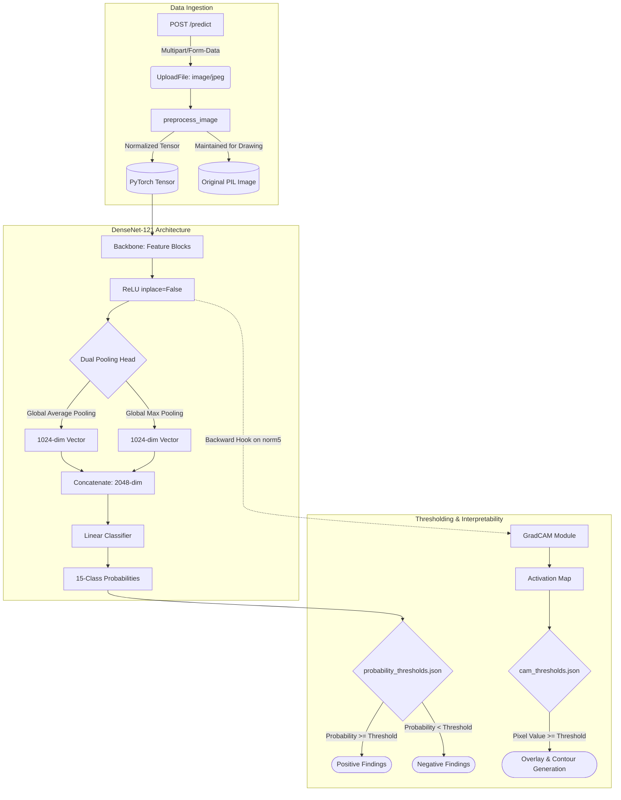
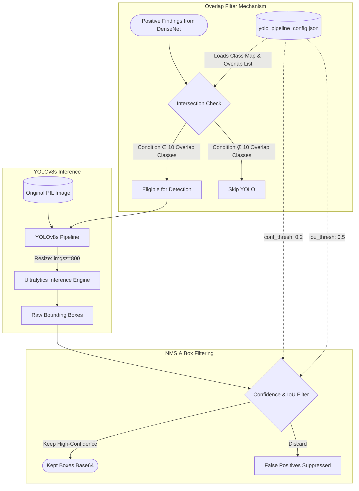
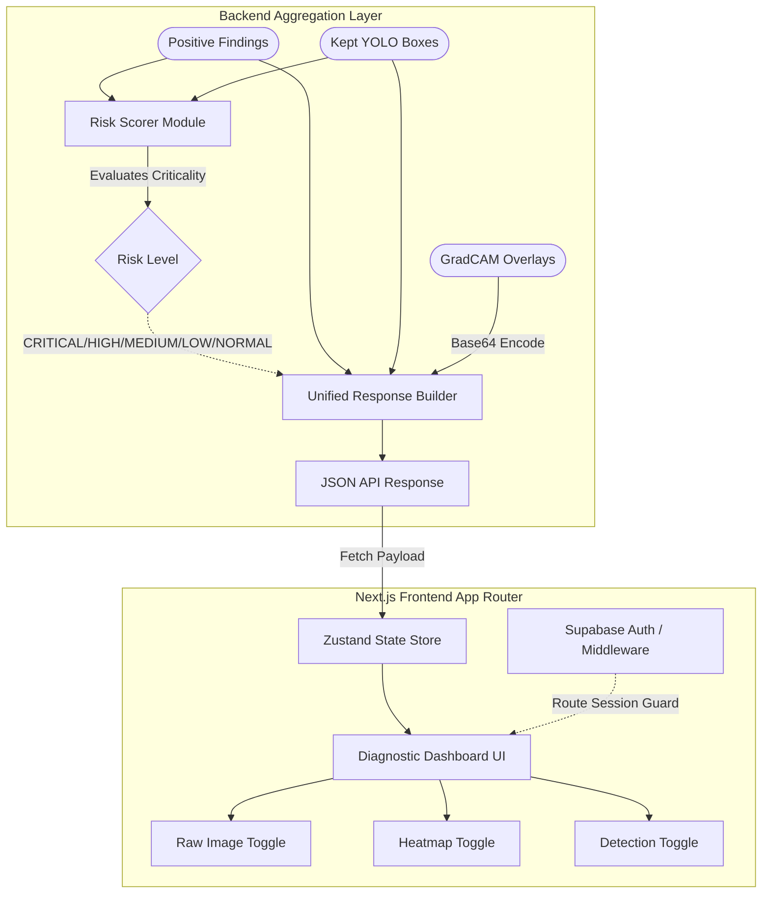

# Neuro

**Multimodal Chest X-Ray Analysis with Explainable AI, Disease Localization, and Risk Scoring**


**Live Link**: [https://neurochest.vercel.app/](https://neurochest.vercel.app/)<br>
**Backend API**: [https://sagarsarangi26-neuro.hf.space/health](https://sagarsarangi26-neuro.hf.space/health)

Neuro is a full-stack medical AI web application designed to analyze chest X-ray images, provide multi-label disease classification, and generate high-resolution localizations using a custom dual-model architecture.

## Key Features

- **Multi-Label Classification**: Accurately detects 14 distinct chest conditions + "No Finding".
- **Explainable AI**: Generates GradCAM attention heatmaps overlaid on the original image, ensuring full transparency in the model's decision-making process.
- **Precise Localization**: Utilizes a fine-tuned YOLOv8s model to draw precise bounding boxes for detected abnormalities.
- **Risk Assessment System**: Automatically categorizes clinical findings into actionable risk levels (CRITICAL, HIGH, MEDIUM, LOW, NORMAL, UNCERTAIN).
- **Clinical Reference Archive**: A built-in sample gallery of pre-loaded medical X-rays allowing users to test the inference engine instantly without uploading files.
- **Advanced Diagnostic UI**: A three-way interactive view mode allowing the user to toggle between the **Raw Image**, **Heatmap (GradCAM)**, and **Detection (YOLOv8)** views.

## The AI Architecture (Dual-Model Pipeline)

Neuro uses a highly specialized pipeline to maximize both broad classification accuracy and pixel-level localization precision.

### 1. Classification & Heatmaps: Custom DenseNet-121

- **Architecture**: A modified DenseNet-121. We replaced the standard classification head with a **Dual Pooling Head**, concatenating Global Average Pooling (GAP) and Global Max Pooling (GMP). This provides a rich 2048-dimensional feature vector capable of capturing both widespread patterns and highly localized anomalies.
- **Classes**: 14 distinct conditions (Atelectasis, Cardiomegaly, Effusion, Infiltration, Mass, Nodule, Pneumonia, Pneumothorax, Consolidation, Edema, Emphysema, Fibrosis, Pleural Thickening, Hernia) + "No Finding".

- **Grad-CAM Visualization**: Applied Grad-CAM to generate heatmaps highlighting the regions of chest X-rays that most influenced the model's predictions, improving interpretability and providing visual insights into the decision-making process.

- **Benchmarks**: Achieves a mean validation AUC of **0.7933** (performing at **94%** of the original CheXNet research model's **0.84**), demonstrating robust, well-calibrated multi-label classification performance.

### 2. High-Resolution Detection: YOLOv8s

- **Role**: While GradCAM provides the general area of attention, YOLOv8s draws crisp, precise bounding rectangles.
- **Benchmarks**: Our YOLOv8s model achieves highly competitive results against published Faster R-CNN baselines while running at a fraction of the computational cost:
  - **Mean mAP50**: **0.412** (**91.5%** relative performance vs. baseline's **0.450**)
  - **Mean Recall (@0.1 FP/img)**: **0.436** (**93.3%** relative performance vs. baseline's **0.467**)

### 3. Pipeline Integration: How They Work Together

The models don't just run in parallel; they inform each other to reduce false positives.

1. **Initial Classification**: The X-ray is fed into DenseNet. Conditions exceeding their specific, individually tuned probability thresholds are flagged as "Positive."
2. **Overlap Gatekeeping**: The backend checks these positive conditions against the **10 Overlap Classes** (Atelectasis, Cardiomegaly, Consolidation, Effusion, Emphysema, Fibrosis, Mass, Nodule, Pleural Thickening, Pneumothorax).
3. **Targeted Bounding**: YOLOv8 is only invoked to draw bounding boxes for the positive conditions identified by DenseNet. DenseNet acts as the high-accuracy gatekeeper, preventing YOLO from hallucinating boxes for conditions the patient doesn't actually have.

## Workflow

An end-to-end technical breakdown of the dual-model pipeline, from API ingestion to frontend state management.

### 1. Classification & Heatmap Generation (DenseNet-121)
The process begins with the `POST /predict` endpoint. The image is preprocessed into a standardized tensor and fed into the custom `DenseNetCustom` architecture. The dual pooling head ensures highly localized anomalies aren't lost in average pooling, while GradCAM taps into `backbone.norm5` via hooks on a non-inplace ReLU.



### 2. Overlap Gatekeeping & Localization (YOLOv8s)
To aggressively suppress false positives, YOLOv8s is subordinated to DenseNet. It is invoked *only* for the subset of DenseNet's positive findings that overlap with YOLO's trained capabilities. 



### 3. Final Aggregation & Dashboard Presentation
The backend synthesizes outputs into a unified diagnostic payload. A heuristic risk scorer assigns triage urgency, and the Next.js App Router presents it through a Zustand-managed interactive interface.



## Tech Stack

**Frontend:**

- Next.js 16 (App Router)
- TypeScript
- Tailwind CSS
- Zustand (State Management)
- Supabase (Authentication)
- GSAP (Animations)

**Backend:**

- FastAPI
- PyTorch (DenseNet Custom Architecture)
- Ultralytics (YOLOv8)
- OpenCV / Pillow (Image Processing)

## Run Locally

Follow these steps to run the complete dual-model pipeline and Next.js frontend on your local machine.

### 1. Clone the Repository
```bash
git https://github.com/sagarsarangi/CXR-Pathology_Analysis.git
cd CXR-Pathology_Analysis
```

### 2. Setup the Models Directory
Because model weights are large, they are excluded via `.gitignore`. You must manually create the `models/` directory and place the weights and configuration files inside.

```bash
mkdir models
```

Download and place the following files inside `models/`:
- `nih-model.pth` (DenseNet weights)
- `best_chestxdet.pt` (YOLOv8s weights)

Next, create the required configuration files in the `models/` directory.

**`models/thresholds_and_metrics.json`**
```json
{
  "probability_thresholds": {
    "Atelectasis": 0.61,
    "Cardiomegaly": 0.85,
    "Effusion": 0.52,
    "Infiltration": 0.75,
    "Mass": 0.64,
    "Nodule": 0.80,
    "Pneumonia": 0.87,
    "Pneumothorax": 0.77,
    "Consolidation": 0.81,
    "Edema": 0.82,
    "Emphysema": 0.81,
    "Fibrosis": 0.86,
    "Pleural_Thickening": 0.78,
    "Hernia": 0.77,
    "No Finding": 0.50
  },
  "cam_thresholds": {
    "Pneumonia": 0.40,
    "Edema": 0.40,
    "Infiltration": 0.42,
    "Consolidation": 0.42,
    "Nodule": 0.60,
    "Mass": 0.58,
    "Pneumothorax": 0.62,
    "Emphysema": 0.52,
    "Cardiomegaly": 0.33,
    "Atelectasis": 0.47,
    "Effusion": 0.43,
    "Fibrosis": 0.50,
    "Pleural_Thickening": 0.50,
    "Hernia": 0.45,
    "No Finding": 0.50
  }
}
```

**`models/yolo_pipeline_config.json`**
```json
{
  "version": "v3",
  "class_map": {
    "Atelectasis": 0,
    "Calcification": 1,
    "Cardiomegaly": 2,
    "Consolidation": 3,
    "Diffuse Nodule": 4,
    "Effusion": 5,
    "Emphysema": 6,
    "Fibrosis": 7,
    "Fracture": 8,
    "Mass": 9,
    "Nodule": 10,
    "Pleural Thickening": 11,
    "Pneumothorax": 12
  },
  "id_to_class": {
    "0": "Atelectasis",
    "1": "Calcification",
    "2": "Cardiomegaly",
    "3": "Consolidation",
    "4": "Diffuse Nodule",
    "5": "Effusion",
    "6": "Emphysema",
    "7": "Fibrosis",
    "8": "Fracture",
    "9": "Mass",
    "10": "Nodule",
    "11": "Pleural Thickening",
    "12": "Pneumothorax"
  },
  "overlap_classes": [
    "Atelectasis", "Cardiomegaly", "Consolidation", "Effusion", "Emphysema", 
    "Fibrosis", "Mass", "Nodule", "Pleural Thickening", "Pneumothorax"
  ],
  "img_size_train": 800,
  "conf_thresh": 0.2,
  "iou_thresh": 0.5
}
```

### 3. Environment Configuration
Navigate to the `frontend/` folder and copy the environment template to create your `.env.local` file.

```bash
cd frontend
cp .env.local.template .env.local
```

Edit `.env.local` to configure your Supabase keys and point to the local backend:
```env
NEXT_PUBLIC_SUPABASE_URL=your-supabase-project-url
NEXT_PUBLIC_SUPABASE_ANON_KEY=your-supabase-anon-key
NEXT_PUBLIC_BACKEND_URL=http://localhost:8000
```

### 4. Run the Backend (FastAPI)
Open a new terminal session. Install Python dependencies and start the Uvicorn server.

```bash
cd backend
python -m venv venv
.\venv\Scripts\activate
pip install -r ../requirements.txt
cd ..
python -m uvicorn backend.main:app --port 8000 --reload
```

### 5. Run the Frontend (Next.js)
Open another terminal session. Install Node modules and start the development server.

```bash
cd frontend
npm install
npm run dev
```

You can now view the application locally at `http://localhost:3000`.
